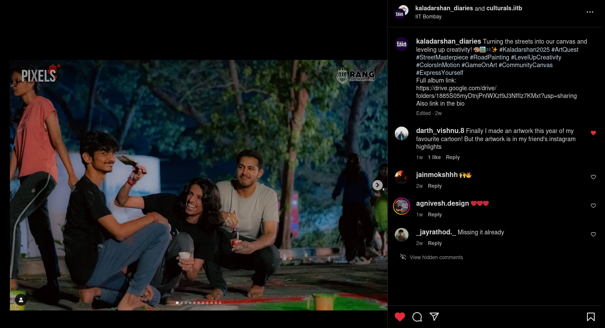

# Mr Bean

The attached image is a really beautiful portrait of Mr Bean, however it is unclear who the artists are. Running exiftool on the image reveals the following information:

```
Location                        : 19.1364638, 72.9088472
Comment                         : Painting Created on 2025:03:08
```

The image is a painting created on March 8, 2025, and the location is in IIT Bombay, Mumbai, India. The artist's name is not mentioned in the metadata.

Searching online for `8th March IIT Bombay painting` gives us the instagram account of the [Fine Arts club](https://www.instagram.com/rang_iitb/%3Fhl%3Den) of IIT Bombay. One post immediately catches our eye, which is of an event called Road Painting, which was held on March 8, 2025. However, that alone doesn't tell us much about the artists. Looking at the collaborators in the post, we find the following accounts: [Culturals IIT Bombay](https://www.instagram.com/culturals.iitb/?e=fcc1f981-107d-4a15-b551-7818c0b775c4&g=5) and [Kaladarshan Diaries](https://www.instagram.com/kaladarshan_diaries/?e=9de189c8-87d6-41c2-aac4-23e8ee4f3b94&g=5). The first account doesn't tell us much about road painting however the second one has a post about the event. 



Scrolling through the pictures in the post, you would not find the image of Mr Bean, however there is a comment by the account [darth_vishnu.8](https://www.instagram.com/darth_vishnu.8/) which mentions creating an artwork of his favourite cartoon. This reveals that one of the artists was Lakshya Gadhwal. 

Now at this point of time, searching `Lakshya Gadhwal CTF team` on Google itself reveals that he is a member of the Cyber Security Community of IIT Bombay and one of the links that pops up, is [this](https://www.linkedin.com/posts/iitb-trust-lab_event-ethicalhacking-ctf-activity-7048550794987511808-AKFG) one, which gives the name of the team as "2f9ec42e502ca050c87a4562d13417559c12bb5b4a29b22e0ffbd9bc1f322960". The other artist who created the painting was [Ankeet Saha](https://www.instagram.com/me_ankeet/) who has put up a picture of the painting on one of his [highlights](https://www.instagram.com/stories/highlights/18024365554511142/).
