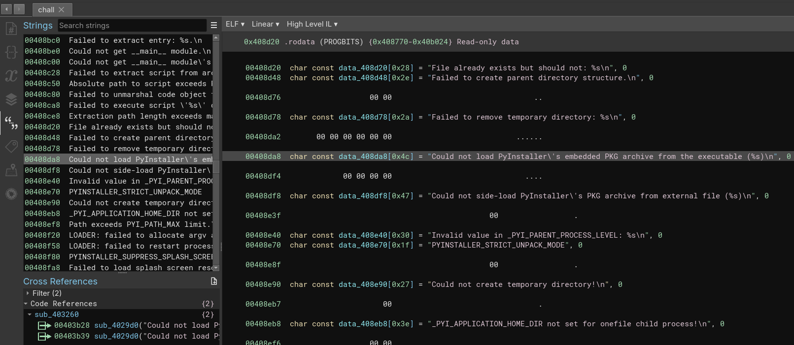

# NFT

Opening the provided ELF file in Binary Ninja, we notice that it has strings mentioning "PyInstaller". 

This indicates that the binary was likely created using PyInstaller, a popular tool for packaging Python applications into standalone executables. After a bit of googling, we come across a tool called [PyInstxtractor](https://github.com/extremecoders-re/pyinstxtractor) that can extract the contents of PyInstaller executables. We can use this tool to extract the contents of the provided ELF file.

```bash
git clone https://github.com/extremecoders-re/pyinstxtractor.git
python3 pyinstxtractor/pyinstxtractor.py chall
cd chall_extracted
```

After running the extraction script, we find a bunch of dynamic library files and one file named `min.pyc` in the extracted directory. This file is a compiled Python file, and we can decompile it using a tool called `uncompyle6` or [Pylingual](https://pylingual.io/). Now we get some minified python code.

```python
# Decompiled with PyLingual (https://pylingual.io)
# Internal filename: min.py
# Bytecode version: 3.13.0rc3 (3571)
# Source timestamp: 1970-01-01 00:00:00 UTC (0)

n = 'originalStyleSheet'
m = 'Enter your password'
l = 'Enter your username'
k = 'images/logo.png'
j = 'flag.jpeg'
h = bytes
g = Exception
f = False
V = 'email'
U = 'username'
T = 'password'
S = open
Q = len
P = range
N = True
K = 'Segoe UI'
J = None

...

a = 'user_data.json'
x = b'b331fbb6d369151a7fa7b2adfdde35baeff3baaa4f2cd83d1583e9aae17b2396'
import base64 as y
z = 'https://nft-server-34949655677.us-central1.run.app/validate'

...

class A2(Y):
    def __init__(A, parent=J, password=J):
        super().__init__(parent)
        A.password = password
        A.result = f
        A.setWindowTitle('Premium Content Activation')
        A.setFixedWidth(300)
        A.setFixedHeight(150)
        B = H()
        J = C('Enter Activation Key:')
        A.key_input = G()
        A.key_input.setEchoMode(G.Password)
        D = F()
        E = L('Activate')

        @L('Cancel')
        case line if I.clicked.connect(A.reject):
            pass  # postinserted
        D.addWidget(E)
        D.addWidget(I)
        B.addWidget(J)
        B.addWidget(A.key_input)
        B.addLayout(D)
        A.setLayout(B)

    def decrypt_flag(H, filename, key):
        try:
            with S(filename, 'rb') as A, A.read() as B:
                C = h.fromhex(key)
                E, D = (B[:16], B[16:])
                G, F = (Z.new(C, Z.MODE_CBC, D), F.decrypt(E))
                with S(j, 'wb') as A, A.write(unpad(G, Z.block_size)):
                    return N
        except g as I:
            return f

    def check_activation(B):
        H = 'Decryption Failed'
        F, E = ('Activation Failed', B.key_input.text().strip())
        if not F:
            A.warning(B, E, 'Please enter an activation key.')
        return None

...

    def show_activation_dialog(A, event):
        C = A.parent.authenticated_user[U]
        D = X.md5(x + C.encode() + w.datetime.today().strftime('%Y/%m/%d').encode()).hexdigest() + 'aa'
        E = A0(h.fromhex(D))
        B = A2(A, E)
        if B.exec_() == Y.Accepted and B.result:
            A.show_premium_content()
            return

    def show_premium_content(D):
        D.gallery_layout.removeWidget(D.premium_label)
        D.premium_label.deleteLater()
        H, G = (5, F // 3)
        if not M.path.exists(D.premium_image_path):
            E = C('Flag image not found')
            E.setFixedSize(200, 200)
            E.setAlignment(B.AlignCenter)
        D.gallery_layout.addWidget(E, G, H)
        A.information(D, 'Premium Content Activated', 'Congratulations! You now have access to premium content.')
...
```

I have omitted the irrelevant parts for brevity. The code is a PyQt5 application that seems to be related to some kind of activation key for premium content. The relevant part is the `decrypt_flag` function, which attempts to decrypt a file named `flag.jpeg` using a key derived from the activation key entered by the user. This key is generated using the MD5 hash of the username and the current date, concatenated with 'aa'. The decryption is done using AES in CBC mode, and the decrypted content is written to `flag.jpeg`.

Looking closely at the MD5 hashing, we can see that the key is generated using some hardcoded value, the username and the current date. From the description and the attached file `user_data.json`, we can infer that the username is `KevinMcCoy` and the year is 2014. Writing a small script to bruteforce the day and month, we can find that the activation key is `TZAQ-XRQU-QXYC-ABOL-APJQ-SIEC-VWVA` and the correct AES decryption key is `4c3aae9c55f3d61e6557f306eb8b881e40ca3898d683dbd958ba04f02259902c`. Using this key, we can decrypt the `flag.enc` file and obtain the flag.


