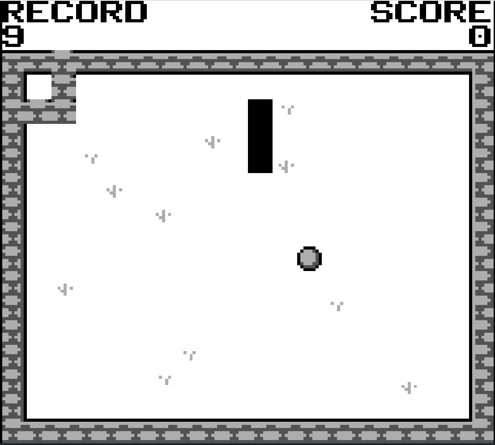
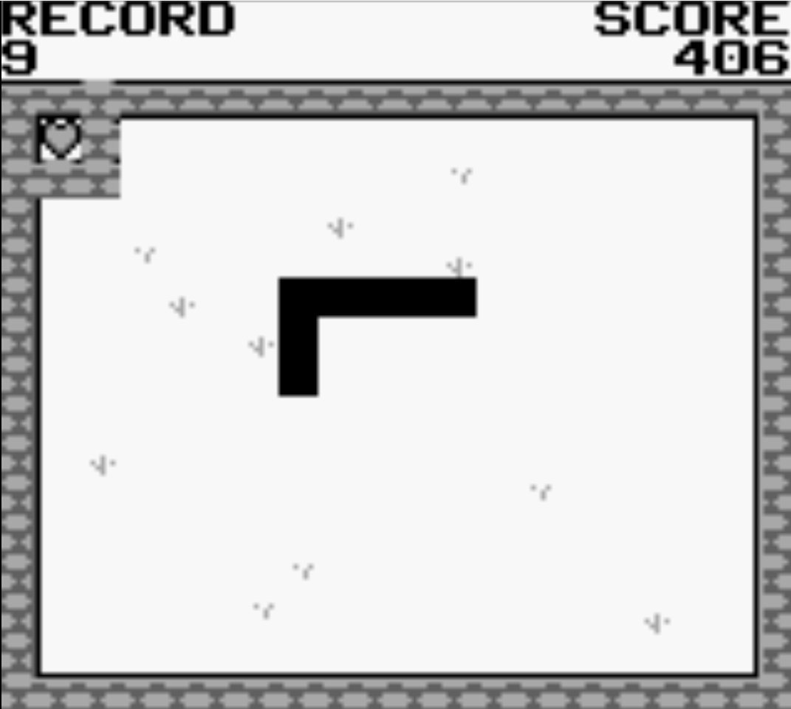
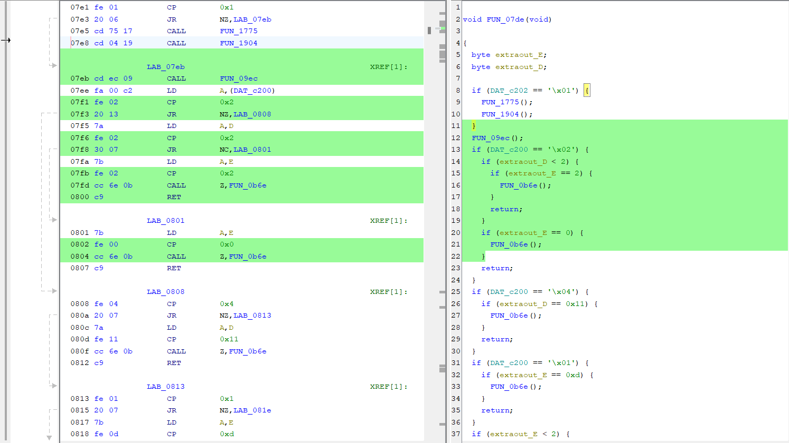

# Snaeky

This challenge provides us with a GB ROM. To run it we can use emulators like [mGBA](https://mgba.io/) or [VisualBoyAdvance](https://vba-m.com/).

On starting up the game we can immediately notice a wall sticking out of the corner.

Also from the description of the challenge it is clear that we need to get a high score for a special apple. To do that we can do a memory search for the score by periodically eating an apple and searching in memory for the change in score. Eventually it narrows down to the memory location `C313`. We can setup a "cheat" in VBA for this memory location to change the score to a high value, say 128.
On doing this we can see that the game gives us a heart apple in the corner of the game. However, since the wall still checks for collisions, we cannot eat the apple. So we need to find a way to disable the wall collision check.

To do this we can disassemble this game in Ghidra using a gameboy plugin. To search for the exact location of the collision check, we can search for the dimensions of the game area. The game area is 15x18 tiles so we can search for numbers around this value. We can find the following code in the disassembly:

Notice that there are some extra checks for collsion detection for the corner walls. Patching up this code to remove the checks, allows us to walk through the walls without dying. Finally, eating the heart apple gives us the flag.

`Breach{M0M-1-H4CK3D-5N4K3}`
