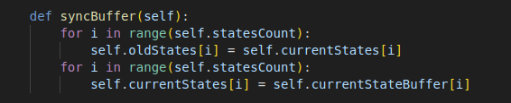
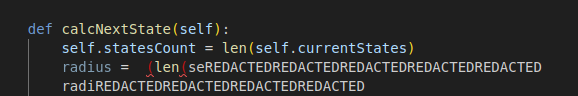
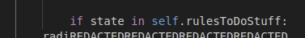
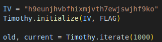
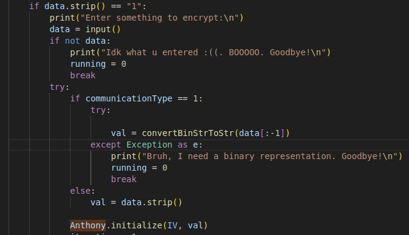
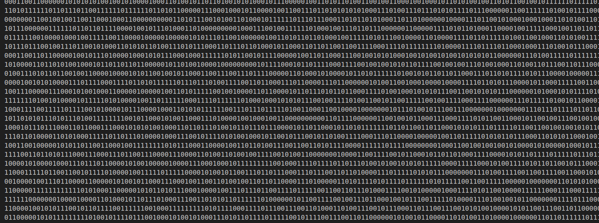
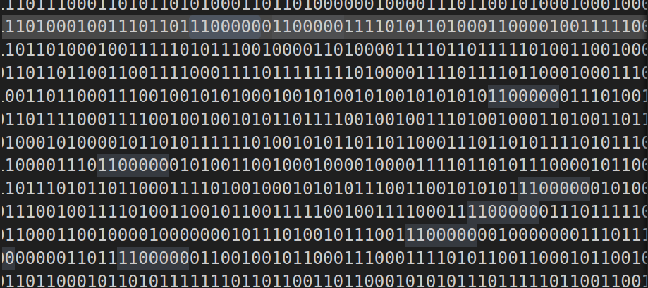
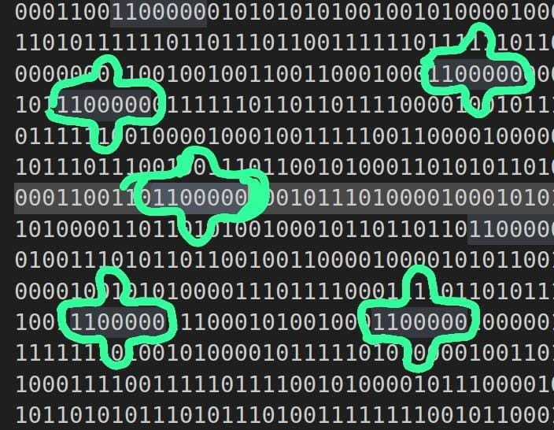

## Timothy
Alright, so when we first connect to the challenge, we're presented with an interface that allows us to encrypt and decrypt text using an `Encryptor` defined in the `Encryptor.py` file.

Looking at the `Encryptor.py` file gives us some insight into how the encryption works. The `Encryptor` class appears to manage three arrays: the current state, the previous state, and a buffer for the current state. The buffer seems to serve exactly the purpose its name suggests.



From this function, we can infer that the arrays are probably updated simultaneously. Another interesting detail is the storage of old values—why retain them instead of discarding them? That seems intentional.

Most of the other functions are helper utilities. The main encryption function, however, is heavily redacted. That said, we can still spot a few key elements. For instance, there’s a variable called `radius` computed from the length of an array. This likely relates to the `rules` array, as `self.statesCount` already holds the length of the `states` array.



And here's a glimpse of how the rules are actually applied:



Additionally, the indentation of the `if` statement suggests that multiple `state` values are being processed within some sort of loop. This implies that `calcNextState` might be using both the current and the previous state—perhaps explaining why the old state is retained!

Alright, that’s some progress. But up to this point, we haven't actually interacted with the server yet.  
Switching over to the `main.py` file reveals where the flag is hidden!



We input some data, which is then used to initialise an encryptor along with an IV:



And then… the encryptor is never used again? That’s odd.  
No matter what input we provide, the code just outputs an iteration of the flag?  
Okay…?

---

Now comes the part where we solve this.

Here’s what we know:
- This is some kind of iterative encryption.
- It is reversible.
- It probably involves a `radius` property.
- It likely uses both the current and the previous states.

### Step 1: Gather data  
We write a `pwntools` script (left as an exercise to the reader) to capture the encrypted output over multiple iterations. Perhaps we can apply some statistical analysis.

Here’s the data for a few consecutive iterations:



Each line represents one iteration, increasing from top to bottom.  
At first glance, it doesn’t seem very helpful… but here's where a small 'aha!' moment comes into play.  
If you stare at the data long enough (maybe while waiting for another process to finish), something interesting may catch your eye.



By dragging your cursor over chunks of the output—specifically, selecting any *seven bits* like in the image—you might notice a curious pattern:  
The **centre bit** from the previous and next iteration is always flipped for certain combinations.



So the `1100000` combination of neighbouring bits results in flipping the previous bit in the next state.  
Digging a bit deeper, we find other combinations behave similarly. Some flip the bit, while others don’t. That’s likely what the `rules` array represents—it dictates which neighbour combinations result in flips and which don’t.

After collecting more iterations and automating this detection, we compile the full set of combinations:

```python
neighbourCombinationToFlipBits = [
    '0000001', '0000011', '0000100', '0000110', '0001010', '0001011',
    '0001100', '0001101', '0001111', '0010101', '0010110', '0011000',
    '0011001', '0011010', '0100000', '0100011', '0100101', '0101100',
    '0101101', '0110001', '0110010', '0110100', '0110111', '0111000',
    '0111001', '0111100', '1000000', '1000001', '1000010', '1000011',
    '1000101', '1001001', '1001100', '1001110', '1001111', '1010000',
    '1010001', '1010011', '1010100', '1010110', '1010111', '1011100',
    '1011110', '1100000', '1100001', '1100100', '1100101', '1100110',
    '1100111', '1101010', '1101011', '1101100', '1101110', '1101111',
    '1110000', '1110010', '1110011', '1110100', '1110110', '1110111',
    '1111001', '1111010', '1111111'
]
```

The `radius` likely refers to the number of neighbours on each side—i.e., a radius of 3 means each bit's next state depends on itself and three bits on either side.

At this point, we realise:  
This is a **second-order cellular automaton with a radius of 3**.

Such automata are **reversible**, which makes sense in an encryption context.  
(Fun fact: some reversible cellular automata can even be used for image encryption and decryption—look up “Critters Cellular Automaton”!)


### The Decryption

Now that we’ve cracked the CA rules, we can reverse the encryption by exploiting the fact that **bit-flip operations are their own inverse**.

So we simply modify `Encryptor.py` to apply the CA rules in reverse, like so:

```python
def calcNextState(self):
    self.cellCount = len(self.currentStates)
    radius = (len(self.rulesToFlip[0]) - 1) // 2
    for i in range(self.cellCount):
        cellStates = ""
        for j in range(-radius, radius + 1):
            idx = (i + j) % self.cellCount
            cellStates += str(self.currentStates[idx])
        if cellStates in self.rulesToFlip:
            self.currentStateBuffer[i] = 1 - int(self.oldStates[i])
        else:
            self.currentStateBuffer[i] = self.oldStates[i]
```

Then we run the following script to reverse the iterations and recover the flag:

```python
from Encryptor import Encryptor, convertBinStrToStr

rules = [ ... ]  # same list from earlier

new = "101000110110101110100010010011001010100000110000110011010010101101100011100111100101011111100010111101010101001111111000001100000011110101011000110101110001011010010101000000011110110111001111101011110011001111001001000111000110101001011011001110110111010100001100001010111100110100111101011100101110001010011100"
old = "101101100101100000001011100111000001001110100010001000111110101010001100011011011000100000111101111110101101111011010010110110100111001001111001000001011100111000101100110001101001111110000010010000001100000101011110111011100111001010000001101100101011010010111110100001001001111011001000011100111011101011101110"

Anthony = Encryptor(rules)
Anthony.currentStates = [int(i) for i in old]
Anthony.oldStates = [int(i) for i in new]
Anthony.currentStateBuffer = Anthony.currentStates[:]
Anthony.cellCount = len(Anthony.currentStates)

for i in range(3000):
    Anthony.iterate(1)
    if "breach" in convertBinStrToStr("".join(map(str, Anthony.currentStates))).lower():
        print("Found it!")
        print(convertBinStrToStr("".join(map(str, Anthony.currentStates))))
        break
```

And finally, we get the flag!

```sh
Found it!
Breach{N0t_Q2it3_Tu4in6_C0mp28t3_81923}
```

---

Cellular automata are capable of much more!  
Some 1D cellular automata are even Turing complete.  
Imagine simulating Conway’s Game of Life (a 2D CA) using a 1D CA—pretty wild, right?

Hope you enjoyed the challenge! 

